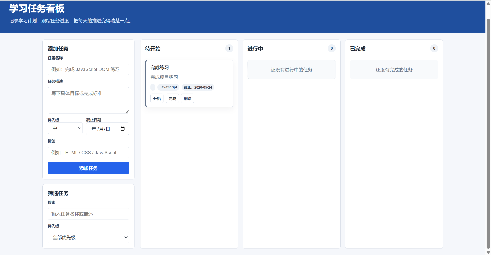

# FocusBoard

FocusBoard 是一个使用 HTML、CSS 和 JavaScript 开发的学习任务看板。

## 功能

- 添加学习任务
- 修改任务状态
- 删除任务
- 搜索任务
- 本地保存数据
- 响应式布局

## 技术栈

- HTML
- CSS
- JavaScript
- Git
- GitHub Pages

## 本地运行

直接使用浏览器打开 `index.html` 即可。

## 项目截图

## 我学到了什么

- DOM 操作
- 事件监听
- 数组方法
- localStorage
- Git 分支开发
- GitHub Pull Request 流程